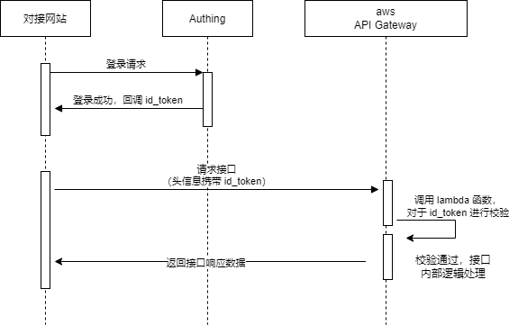
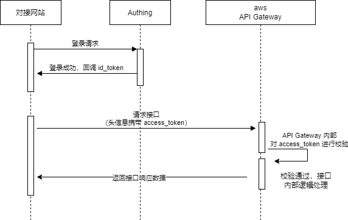
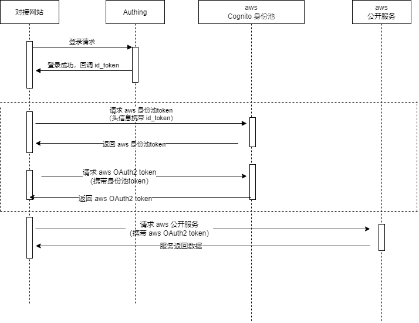

[简体中文] | [[English](README.en.md)]

# AWS集成Authing认证服务的演示

这是一个简单的示例，演示如何在AWS国内区域集成 Authing.cn 的认证服务，用来做为AWS Cognito User Pool的替代方案。

## 基本介绍

Amazon Cognito User Pool 是 AWS 做为身份池的托管服务，在许多 AWS Solutions 或是用户创建的 WEB/移动端 应用都被广泛的使用。通过该服务可以快速建立一个身份池并与 AWS 的其他服务集成，并用来做身份认证和授权。一个常用的场景是 API Gateway 可以集成 Cognito User Pool 进行用户身份认证与授权，方便对API进行保护。另一个常用的场景是结合 Cognito Identity Pool 来在 Web或移动端 安全地获取 AWS 临时密钥，进而访问其他 AWS 服务。

目前 Cognito User Pool 服务在国内区域暂时未上线，这对将国外的 AWS Solutions 或用户应用迁移至国内区域部署造成困难。这个项目会演示如何通过集成第三方的认证服务(Authing.cn)，来替代 Cognito User Pool 的功能，并实现上述提到的两个常用的业务场景。

寻找 Cognito User Pool 的替代方案的基本思路，是找到一个基于 OpenID Connect 协议的认证服务，可以是第三方SaaS(如Authing, Auth0等)，或是自建(如基于开源的 Keycloark 软件)。Authing 是 AWS 在国内的合作伙伴，因此在这个项目会演示如何使用 Authing 来做为 Cognito User Pool 的替代方案。

可以访问下面演示网站, 进行简单的用户注册后查看访问效果

https://yunnysunny.github.io/aws-authing-demo/

## 架构设计

### 使用 lambda 函数对 API Gateway 进行鉴权

**图 2.1.1**

lambda 函数用于给 API Gateway 中的接口进行鉴权，对接网站使用 [OIDC 协议](https://docs.authing.cn/v2/concepts/oidc/oidc-overview.html) 和 Authing 进行鉴权后拿到 id_token ，请求发送到 API Gateway 时携带这个 id_token，之后这个 id_token 被配置的 lambda 函数进行校验，校验成功后才会执行接口逻辑代码。

### 使用 OIDC 协议对 API Gateway 进行鉴权

> 此方式仅支持 [HttpApiAuth](https://docs.aws.amazon.com/zh_cn/zh_cn/serverless-application-model/latest/developerguide/sam-property-httpapi-httpapiauth.html) 类型的 HTTP 接口。

API Gateway 也可以直接使用 [OIDC 协议](https://docs.authing.cn/v2/concepts/oidc/oidc-overview.html) 进行鉴权，如需编写 lambda 函数，只需要在 API Gateway 中做配置即可，具体配置可以参见文档 [添加-api-授权](docs/api_gateway_oidc.md#添加-api-授权) 。

**图 2.2.1**

对接网站和 Authing 鉴权完成后，将得到的 access_token 带入 API Gateway 的请求头信息中，API Gateway 内部自己就会对这个 access_token 进行校验。这样做的话优势比较明显，不用自己写代码，而且可以提高接口的请求性能。

> 对于此认证流程，也可以参见官方文档
>
> [使用 JWT 授权方控制对 HTTP API 的访问](https://docs.aws.amazon.com/zh_cn/apigateway/latest/developerguide/http-api-jwt-authorizer.html) 
>
> [OAuth 2.0/JWT 授权方示例](https://docs.aws.amazon.com/zh_cn/zh_cn/serverless-application-model/latest/developerguide/serverless-controlling-access-to-apis-oauth2-authorizer.html)
>
> [排查 HTTP API JWT 授权方的问题](https://docs.aws.amazon.com/zh_cn/apigateway/latest/developerguide/http-api-troubleshooting-jwt.html)

### 使用 cognito 身份池进行鉴权

**图 2.3.1**

如果对接网站需要访问 aws 中的开放服务，则可以先和 Authing 进行鉴权，拿到 Authing 的 token 后，发送到 cognito 后端获取一个 aws 内部的 token，然后使用这个 aws 的 token，便可方便的访问 aws 的开放服务了。

**图 2.3.1** 中虚线圈出来的部分，对应 aws JavaScript SDK 中的 [CognitoIdentityCredentials](https://docs.aws.amazon.com/AWSJavaScriptSDK/latest/AWS/CognitoIdentityCredentials.html) 类，不需要自己手动实现，直接调用接口即可。具体示例参见 frontend/scripts/test.js 。

## 准备工作

各种资源创建的说明，参见 [这里](docs/prepare.md)。

## 开发指南

项目配置文件的生成说明，参见[这里](docs/dev_guide.md)。