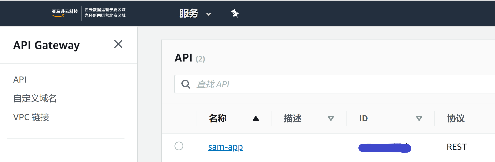
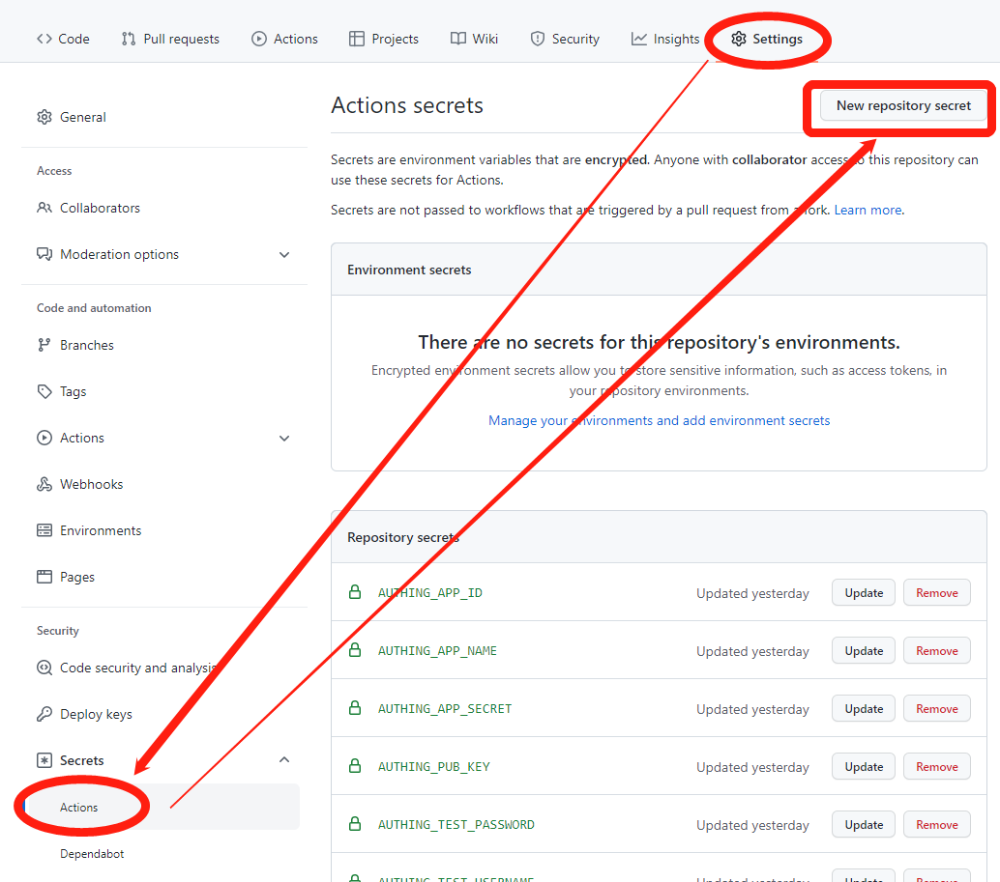

# 开发指南

为了保证项目迁出后能够通用，项目中所有配置相关的字段全都没有写死。所以项目在初始化的时候，需要将这些字段值生成。项目中提供了若干工具脚本，这些脚本需要依赖读取环境变量来生成配置文件。

## 1. 环境变量

当前项目依赖的环境变量如下表所示：

| 变量名                 | 说明                                                         | 用途            |
| ---------------------- | ------------------------------------------------------------ | --------------- |
| AUTHING_APP_ID         | Authing 的应用 ID                                            | 前端 sam-config |
| AUTHING_APP_NAME       | Authing 的应用名称                                           | 前端 sam-config |
| AUTHING_APP_SECRET     | Authing 的应用密码                                           | 测试用例        |
| AUTHING_TEST_USERNAME  | 在当前 Authing 应用下创建的用户名，注意只能使用用户账号，使用手机号或者邮箱无法通过单元测试 | 测试用例        |
| AUTHING_TEST_PASSWORD  | 在当前 Authing 应用下创建的用户的密码                        | 测试用例        |
| SP_REDIRECT_URL        | 对接 Authing 的网站的 OIDC 协议回调地址                      | 前端            |
| AWS_LAMBDA_AUTH_API_ID | aws 测试 lambda 授权用的 api ID                              | 前端            |
| AWS_OIDC_AUTH_API_ID   | aws 测试 oidc 授权用的 api ID                                | 前端            |
| AWS_DEFAULT_REGION     | aws 的分区，国内只能使用北京（cn-north-1）分区，因为宁夏分区不能创建身份池 | 前端 sam-config |
| AWS_IDENTITY_POOL_ID   | aws 上创建的身份池 ID                                        | 前端            |
| AWS_BUCKET_NAME_DEPLOY | 部署 api 代码用的 bucket 名称                                | sam-config      |
| AWS_BUCKET_NAME_TEST   | 测试 s3 下载用的 bucket 名称                                 | 前端            |
| AUTHING_PUB_KEY        | Authing 应用的公钥 json 字符串                               | API             |
| AWS_ACCESS_KEY_ID      | aws 的管理密钥 ID                                            | sam-cli         |
| AWS_SECRET_ACCESS_KEY  | aws 的管理密钥                                               | sam-cli         |

**表 1.1**

其中 `AUTHING_APP_ID` `AUTHING_APP_NAME` `AUTHING_APP_SECRET` `AUTHING_PUB_KEY` 在 Authing 创建完应用后会得到。`AWS_ACCESS_KEY_ID` `AWS_SECRET_ACCESS_KEY` 在拥有 aws 账号后可得。`AWS_IDENTITY_POOL_ID` 需要在 aws 中创建身份池得到。`AWS_BUCKET_NAME_DEPLOY` `AWS_BUCKET_NAME_TEST` 在创建 bucket 后可得。`SP_REDIRECT_URL` 是你集成网站上定义的回调接口地址。`AWS_LAMBDA_AUTH_API_ID` 需要在部署完 api 代码后，才能在 aws `API Gateway` [后台](https://console.amazonaws.cn/apigateway/main/apis) 查询到。`AWS_OIDC_AUTH_API_ID` 需要手动在 `API Gateway` 后台创建，具体参见[文档](api_gateway_oidc.md) 。

**图 1.1**

 ## 2. 生成配置文件

### 2.1 生成后端依赖的配置

除 `AWS_LAMBDA_AUTH_API_ID` 外其他的环境变量均可提前得到。将这些提前得到的数据到环境变量中，然后分别运行 `yarn config:sam` `yarn config:key`，即可生成配置文件 `samconfig.toml` 和 `protected-api/key.js`。然后运行 `sam build` 可以对 api 代码进行打包，最后运行 `sam deploy` 即可将打包好的代码部署到 `AWS_BUCKET_NAME_DEPLOY` 定义的这个 bucket 中。然后的登录 `API Gateway` [后台](https://console.amazonaws.cn/apigateway/main/apis) 即可得到部署成功的 API ID，拷贝协议类型为 `REST` 的那个 ID，将其配置到环境变量 `AWS_LAMBDA_AUTH_API_ID`  中。

> `AWS_OIDC_AUTH_API_ID` 用于测试使用 OIDC 协议对 API Gateway 进行鉴权的功能，不过现在还没有调试成功。

### 2.2 生成前端依赖的配置

在 2.1 完成后，运行 `yarn config:front` 即可生成前端所需的配置文件到 `fontend/scripts/congfig.js` 中。这样就可以部署演示用的前端代码了。

### 2.3 使用 github action

项目中配置了 github action ，可以支持 push 代码时自动部署前端代码到 github.io ，push 以 `v` 开头的分支时，自动将 API 部署到 aws。

**图 2.3**

在 github 项目中点击 **Settings** 标签页，然后点击左侧菜单的 `Secrets` -> `Actions`，在打开的页面中点击 **New repository secret** 即可添加环境变量。配置完 **表 1.1** 中的变量后，触发的 github action 会自动生成配置文件，并且构建代码。
