# 准备工作

## 1. 创建bucket

### 1.1 api 用 bucket

打开 https://console.amazonaws.cn/s3/buckets ，选择 **Create bucket** 按钮。

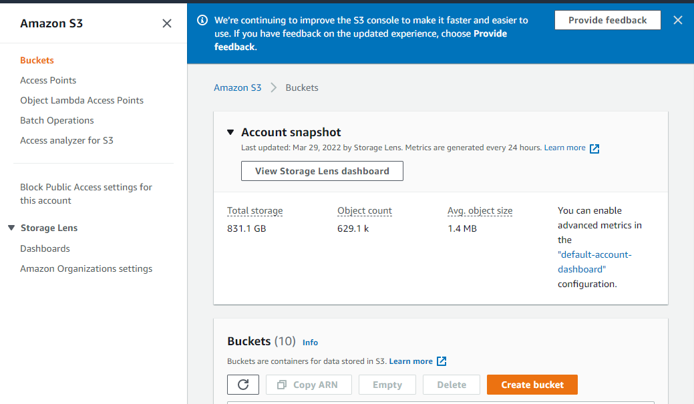

**图 1.1.1**

打开新页面，输入 `Bucket name` 后，点击右下角 **Create bucket** 按钮，即可完成创建过程，将这个 `Bucket name` 记录下来，后续部署 api gate 的代码时要用到这个 bucket。

### 1.2 前端测试用 bucket

使用同样的步骤创建另外一个 bucket，这个 bucket 单独用于前端项目测试 s3 的下载 API。同时由于当前 bucket 需要在前端访问，我们需要对其做跨域允许设置。创建完成后，在列表中点击 bucket 名字，选择 **Permissions** 选项卡，然后下拉滚动条，找到 **Cross-origin resource sharing (CORS)** 区域，点击 **Edit** 按钮，

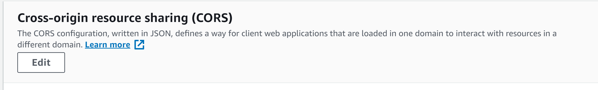

**图 1.2.1**

输入如下 JSON 代码：

```json
[
    {
        "AllowedHeaders": [
            "*"
        ],
        "AllowedMethods": [
            "HEAD",
            "GET",
            "PUT",
            "POST",
            "DELETE"
        ],
        "AllowedOrigins": [
            "*"
        ],
        "ExposeHeaders": [
            "ETag",
            "x-amz-meta-custom-header"
        ]
    }
]
```

**代码 1.2.1**

然后点击 **Save changes** 按钮保存。


## 2. 获取 AWS 凭证

> 如果之前已经获取过 access_key ，那么可以跳过当前小节。

访问 https://console.amazonaws.cn/console/home 首页，然后在导航菜单的用户名处单击，在弹出的菜单中选择 `My Security Credentials` 。

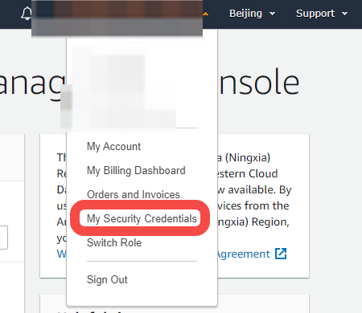

在打开的页面中选择 **Create access key** 按钮


图 2.1

会弹出一个 access key 生成成功的窗口

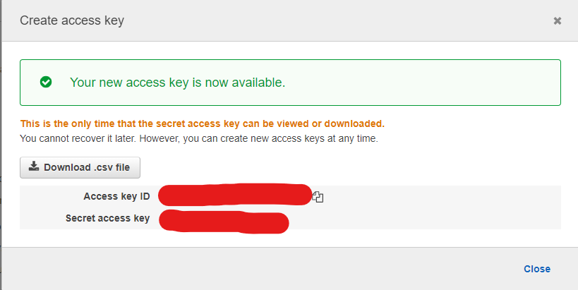

图 2.2

## 3. 创建 Authing 应用

通过 authing.cn 进入控制台，打开 `应用` 下面的 `自建应用` 子菜单，然后点击按钮 **创建自建应用**，

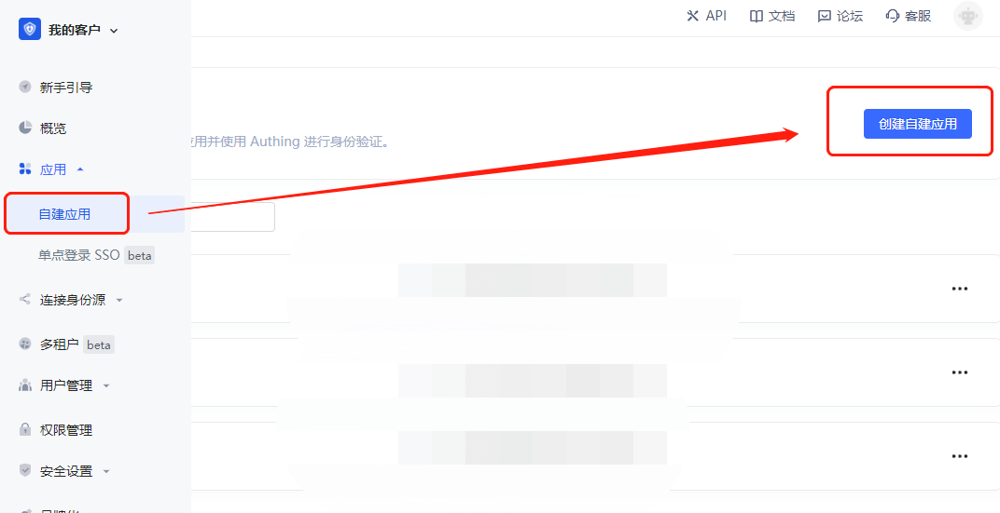

图 3.1

接着会弹出 `创建自建应用` 的对话框，在里面填入 `应用名称` 和 `认证地址` ，然后点击 **创建** 按钮。

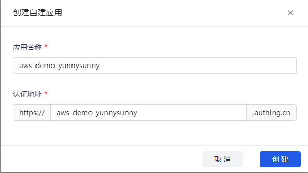

图 3.2

点击创建后，会打开应用的修改页面


图 3.3 

其中端点信息部分的数据，都是有用处的，需要将里面的 `App ID` `App Secret` `Issuer` 的信息都复制下来，后面会用到。`JWKS 公钥端点` 的信息也需要用到，打开上面的链接地址，会得到一个 JSON 输出，格式如下：

```json
{
    "keys": [
        {"e":"","n":"","kty":"","alg":"","use":"","kid":""}
    ]
}
```

代码 3.1

将 `keys` 数组中的元素复制出来，后续会用到。

然后往下拉浏览器滚动条，看 `认证配置` 部分

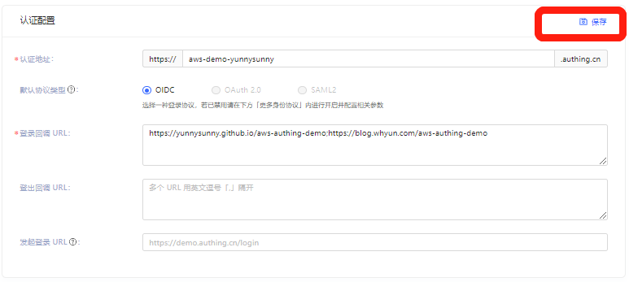

图 3.4

将 `登录回调 URL` 部分改成你的应用的接受 `id_token` 参数的回调地址链接，多个连接之间通过 `,` 分隔，记住改完后不要忘记保存。

接着往下看 `授权配置` 部分，本测试项目的代码选择使用 OIDC 的 implicit 授权模式，使用授权返回的 `id_token` 字段用于 aws 的后续鉴权。签名算法选择了 RSAWithSHA256。同样记着，修改完成之后点击保存按钮。

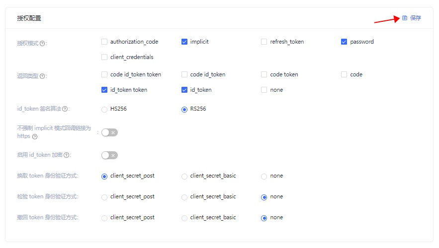

图 3.5

## 4. 创建认证源

打开 https://console.amazonaws.cn/iamv2/home ，然后点击 按钮 **Add provider**

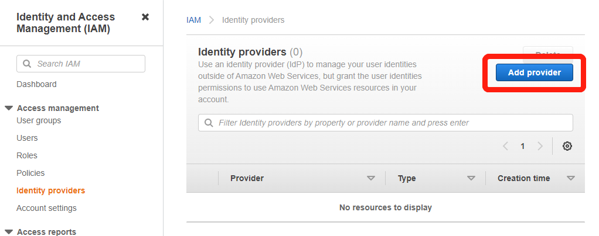

图 4.1

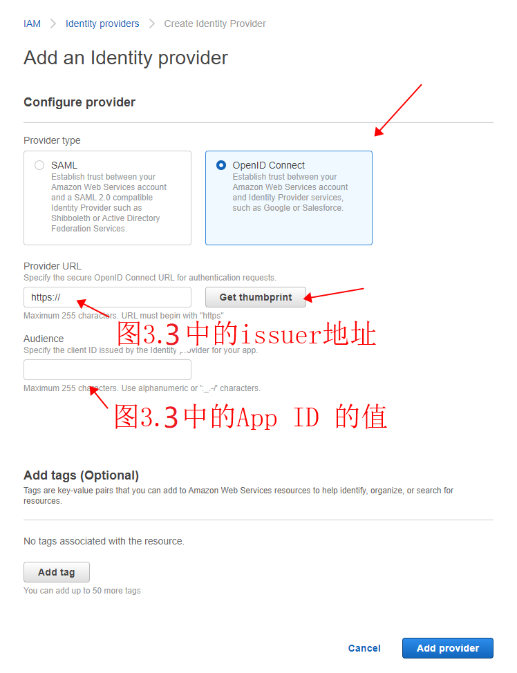

图 4.2

`Provider type` 选择 `OpenId Connect`。`Provider URL` 填入 图 3.3 中的 `Issuer` 地址。然后点击 **Get thumbprint** 会验证 Authing 的 https 证书是否正确。`Audience` 填入 图 3.3 中的 `App ID` 的值。

填入完成之后，点击按钮 **Add provider** 会跳转回 **图 4.1** 并显示刚才创建的 provider，其格式为  `Issuer` 地址去掉 https 的一个字符串。

## 5. 创建身份池

访问 https://console.amazonaws.cn/cognito/home 点击 **Manage Identity Pools**

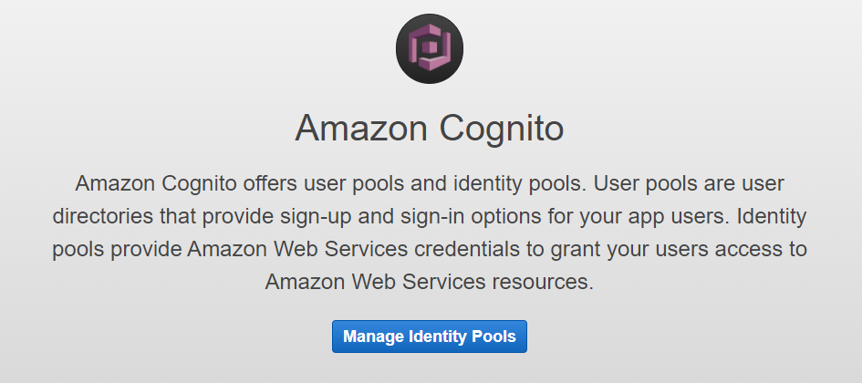

图 5.1

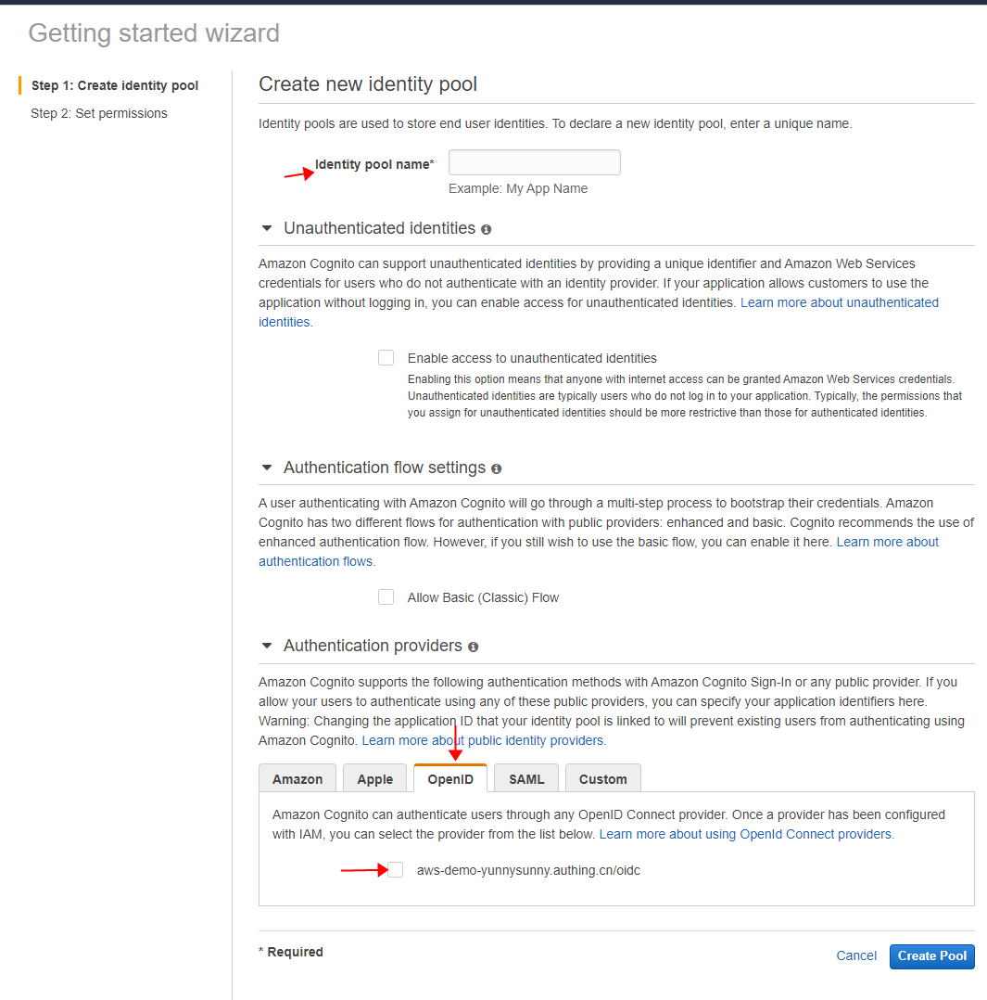

图 5.2

填入 `Identity pool name` ，在 `Authentication providers` 中选择 `OpenID` tab 页，选择我们在第 4 节创建的身份源打勾，最后点击 **Create Pool** 按钮。

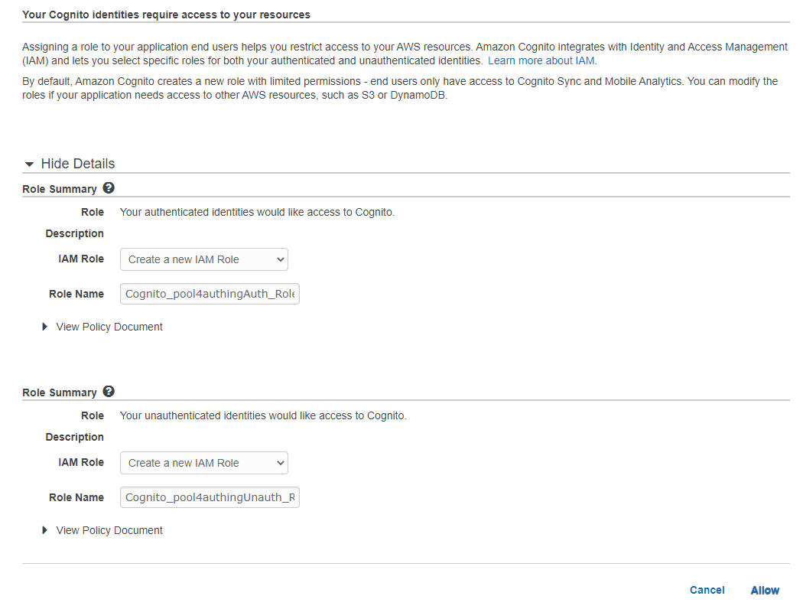

图 5.3

创建完成后，会级联要求生成角色，点击 **Allow** 按钮 即可。之后会弹出示例代码，默认是 Andorid 代码，不过无所谓，我们主要是把示例代码中的 `Identity pool ID` 字段（如 **图 5.4** 所示）拷贝出来，以备用。

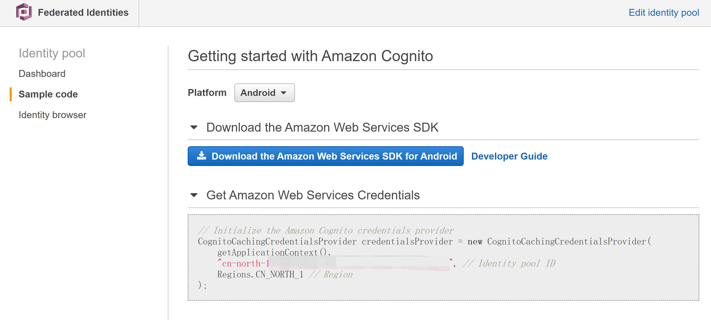

图 5.4

## 6. 修改角色权限

图 5.3 在创建身份池的时候，级联创建了一个角色，由于我们在示例代码中需要演示语音生成的功能，需要给这个角色添加权限，否则示例代码无法运行。首先打开角色设置页面 https://console.amazonaws.cn/iamv2/home?#/roles，找到 图 5.3 对应的角色，点击它。

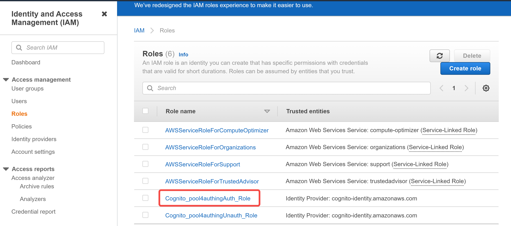

**图 6.1**

在打开的页面中点击 **Add permissions** 按钮，在弹出菜单中选择 `Attach policies` 。

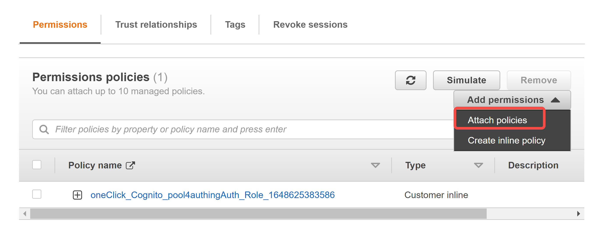

**图 6.2**

然后在打开的页面中点击 **Create Policy** 按钮。

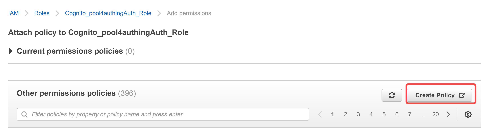

**图 6.3**


在新打开的页面中展开 Service 表单项，搜索 `s3`，然后选择给出的 `s3` 服务

> 注意 **图 6.3** 的页面不要关闭，这里创建策略的流程完成之后，并不会和当前操作的角色进行自动关联，你必须保留 图 6.3 页面，以待后续进行关联。

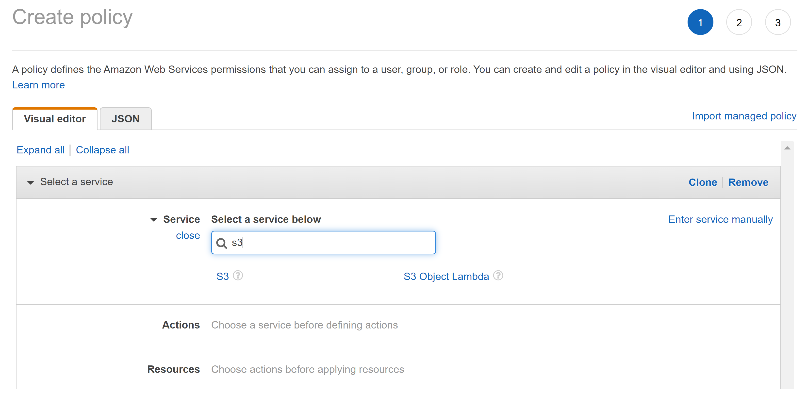

**图 6.4**

在 Actions 表单项中搜索 `getobject`，然后勾选 `GetObject`

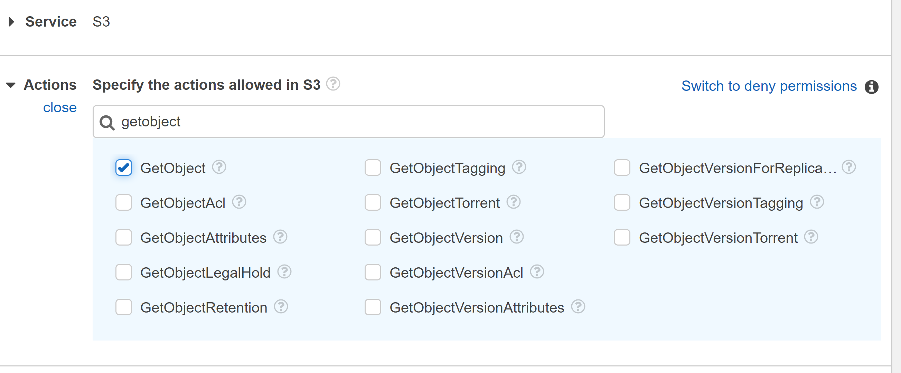

**图 6.5**

在 Resources 表单项中选择 `All resources`。

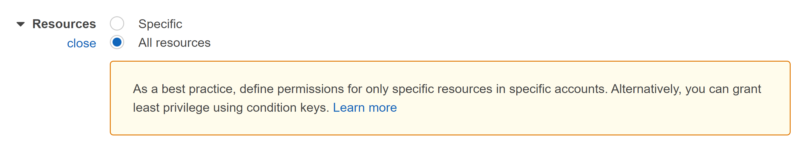

**图 6.6**

接着点击 **Add additional permissions** ，

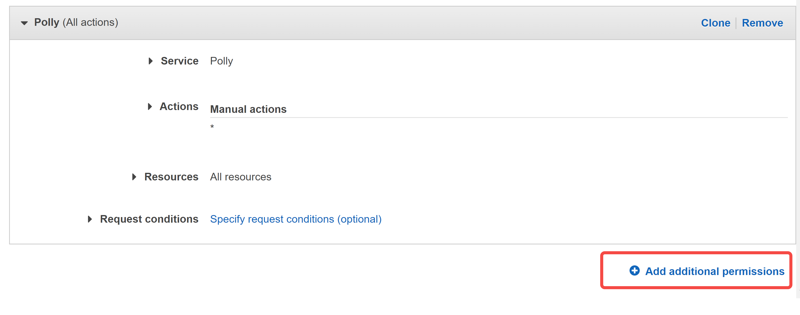

**图 6.7**


上述就把权限相关的配置设定完成，然后点击 **Next: Tags** 按钮。


**图 6.8**

再点击 **Next: Review** 按钮。

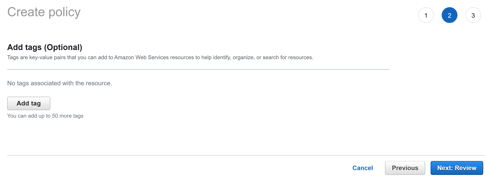

**图 6.9**

在 `Name` 表单项中填写策略的名字，然后点击 **Create policy** 按钮。

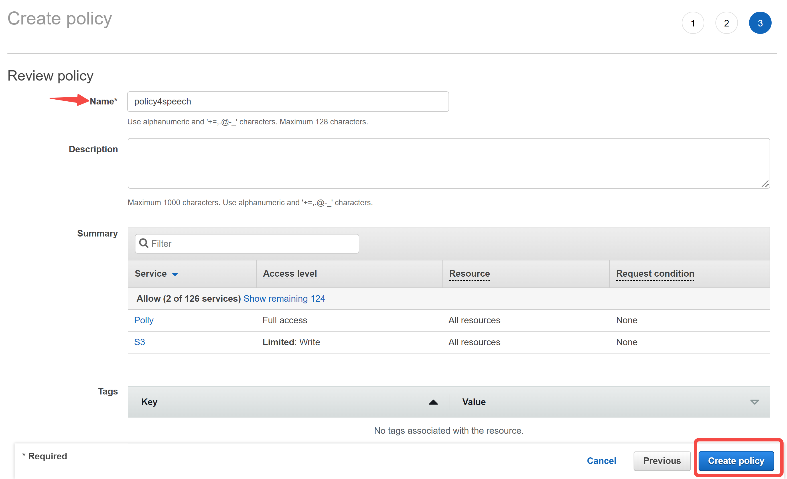

**图 6.10**

这样当前策略就创建完成了。接着就是把策略和图 6.1 中的角色进行关联，回到图 6.3 的页面，点击其上面的刷新按钮，然后就会出现刚才创建完成的策略，然后勾选它，最后点击按钮 **Attach policies**。

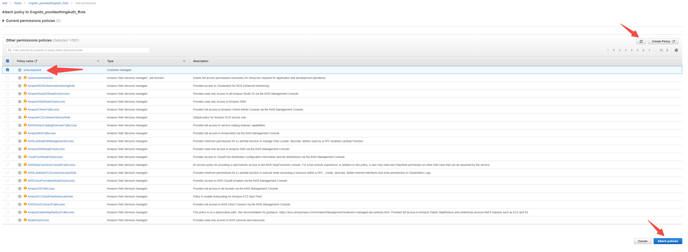

**图 6.11**

添加成功后，会显示在角色的允许策略列表中显示刚才创建的策略。

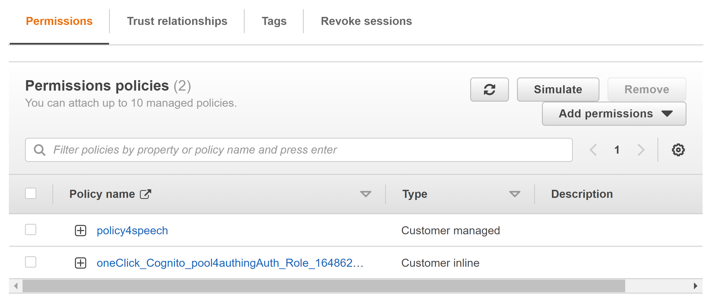

**图 6.12**

## 7. 添加用户

> 这一步用于获得登录 Authing 应用所需要的用户名和密码

在 console 管理后台选择 `用户管理` -> `用户列表`，然后点击**创建用户**

**图 7.1**

在弹出的对话框中，输入用户名、密码，点击**保存**按钮，并且将输入的内容记录下来，后续要使用这个账号登录新建的应用。示例项目中的测试用例，也需要依赖用户名和密码的环境变量来完成测试。

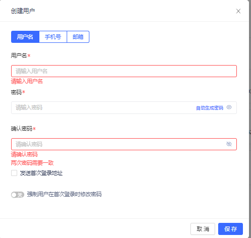

**图 7.2**
